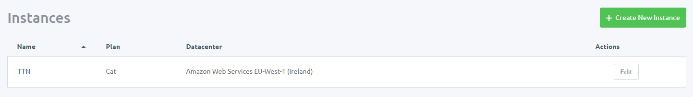

# TTN Mapper

A web based ([vuejs](https://vuejs.org/) + [firebase](https://firebase.google.com/)) signal mapping tool for The Things Network

 &nbsp;


## How it works

This app works in combination with a connected TTN node and connects to the associated nodes TTN MQTT endpoint* and listens for new packets. When a new packet is received, the information is combined with your smartphones GPS location and is then sent to a centeral database to be processed.

On the server, the packets are inspected and two things happen. 

1. Any new gateways are extracted and added to a gateways collection. If the gateway has a geo location associated with it, the gateway will be plotted on all connected maps.

2. The best SNR and RSSI readings are extracted from the packet and combined with previous readings falling within a given 100m2 area determined by the smartphones geolocation. Readings are combined as an Expontential Moving Average (EMA), giving more weight to the latest readings and degrading old readings over time.

To use, follow the installation instructions below, then launch the application in your smartphones browser. With a TTN node connected, and a good smartphone signal, simply press the connect button in the bottom corner to connect and start the mapping process. Once finished, simply click the connect button again to disconnect.

\* In order to use MQTT in a web browser the MQTT server needs to support MQTT over WebSockets. Unfortunately, the TTN server does not support this so we have to use a bridging server to proxy the packets for us.

## Getting set up

### Configure MQTT
The Things Network atutomatically provides an MQTT server you can connect to and listen for device packets out of the box. You can find [full details here](https://www.thethingsnetwork.org/docs/applications/mqtt/quick-start.html), but essentially you'll need a few pieces of information from your TTN application console:

1. **Region** - The region of the application. You'll find this as the end part of the applications handler name, ie a handler name of `ttn-handler-eu` would be the region `eu`.
2. **Application ID** - The app id of your TTN application.
3. **Access Key** - A configured access key in base64 encoded format from your TTN application.
4. **Device ID** - The device id of the device you want to listen to.

These then combine to form the credentials for the MQTT server:

1. **Host:** \<Region>.thethings.network
2. **Username:** \<AppId>
3. **Password:** \<AccessKey>
4. **Topic:** +/devices/\<DeviceId>/up

Unfortunately, as mentioned in the [How it works](#how-it-works) section, we can't connect directly to the TTN MQTT server from a web browser due to the fact it doesn't support MQTT over WebSockets so to get around this, we need to create a bridge via an MQTT server that does.

The easiest way I've found to do this us by using [CloudMQTT](https://www.cloudmqtt.com/), an MQTT server as a service provider.

First start by creating a CloudMQTT account and then log in to the console. From there click the "create new instance" button in the top right hand corner.


On the "Create new instance" screen, give your instance a name and select the plan + data center location you wish to use. The free "Cute Cat" plan is fine for our needs, and the data center location should be the nearest location to you. Once complete, click the "create new instance" button to create your instance.


On the instances dashboard, click the name of your new instance start configuring it.



On the details screen, note down the server, user, password and WebSockets port details as we'll need those later.


Next, from the menubar click the "Bridges" link to start configuring a bridge.


In here, you'll want to insert the details of the TTN MQTT server in the following format:

````
mqtt://<AppId>:<AccessKey>@<Region>.thethings.network:1883
````

For the topic we can leave it as `#` as we'll just have it proxy all mesages that come through it (we'll filter what we listen for in the actual app later on), and for direction we'll want to set that to `Both` and then click save to save the configuration. 

### Configure the app

To setup an instance of TTN Mapper app, you'll first need to create a fork of this repository by clicking the fork button in the top right hand side of this repository.


In your fork, navigate to `js/ttnmapper.config.js` and click the pencil edit icon in the top right hand corner.


Update the device id and MQTT details using the details from CloudMQTT (not the TTN ones), then commit your changes back.


**NB:** For now we'll log all readings to a central shared database so we won't modify the firebase settings, but if you'd like to host your own database, you'll need to setup a firebase account and install the [firebase functions](functions/README.md) accordingly.

### Deploy the app

If you are familiar with hosting, then you can host the files wherever you see fit, however for simiplicity I recomment using github pages and just serve them straight from your repository.

To do this, in your repository go to the settings section


Then scroll down to the "GitHub Pages" section and click to enable it on the master branch. 


Once enabled, you'll be able to access the app at the URL:

````
https://<GitHubUsername>.github.io/ttnmapper/
````

**NB:** If you do host the application yourself, it must be accessing over a secure protocol so an SSL certificate is required.

### Install the app on your smartphone

To install on your device, simply navigate to the above URL in a browser, then in the top right menu, click the "Add to homescreen" option. With that you can now launch your app from your homescreen.

## Known Limitations
Being web based, there are a few known limitations:

1. Can't currently keep smartphone awake so you need to constantly interact with it to prevent phone sleeping.

## Todo

- [ ] Convert into a fully fledged [PWA](https://developers.google.com/web/progressive-web-apps/)

## Acknowledgements

A big thank you to [JP Meijers](https://twitter.com/jpmeijers) the creator of the original [TTN Mapper](http://ttnmapper.org) that enspired this project.

## License

Copyright © 2017 Matt Brialsford, Circuitbeard

Licensed under the [MIT License](LICENSE.md)